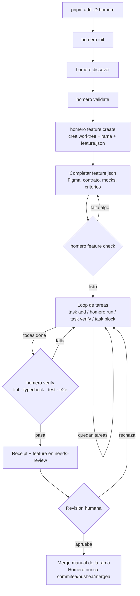
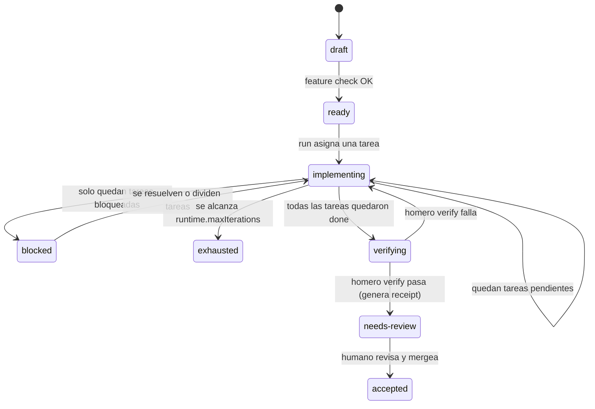

# Homero

Harness interno de frontend para Falabella Seguros: CLI + adapters para
trabajar con GitHub Copilot o Claude Code usando Tomaco, Figma, contratos,
mocks y verificación con Playwright.

## De un vistazo

Homero no es solo un instalador de archivos. Convierte cada feature en un
**contrato ejecutable** (`feature.json`) y un **loop de tareas con estado en
disco** (`state.json` + `events.ndjson`), para que la IA pueda retomar el
trabajo exactamente donde quedó — aunque cambie de sesión o de cliente
(Copilot/Claude) — y para que nadie, ni la IA, se autoapruebe.



Cada caja de ese diagrama se explica en detalle en [Uso](#uso). Si solo
quieres los comandos, ve directo a la [tabla de comandos](#comandos).

## Requisitos

- Git, Node.js, `pnpm`
- Un repositorio frontend con `package.json`
- Figma aprobado y un contrato backend (o ejemplos/cURLs) por feature

## Instalar

```powershell
pnpm add -D github:DanielRamosValenzuela/homero#v0.1.0
pnpm exec homero init --target . --client both --project-name mi-proyecto
pnpm exec homero discover --target .
pnpm exec homero validate --target . --client both
```

`--client` es `copilot`, `claude`, o `both`.

Si usás `copilot`, `homero-figma` necesita el servidor MCP de Figma registrado
para el coding agent de Copilot a nivel de repo u organización (repo
**Settings → Copilot → Coding agent → MCP servers**) — es una superficie de
configuración distinta a `mcp.example.json`, que solo conecta Figma MCP para
uso local/Claude. Sin ese registro, `homero-figma` no puede leer el diseño ni
bajar assets por su cuenta en Copilot.

```powershell
pnpm exec homero setup playwright --target .
```

Instala `@playwright/test`, `@playwright/cli`, `@axe-core/playwright` y
Chromium (usa `--dry-run` para ver qué haría antes de instalar).

```powershell
pnpm exec homero setup graphify --target .
```

Instala [graphify](https://github.com/Graphify-Labs/graphify) (vía `uv`,
`pipx`, o `pip` — requiere Python 3.10+) y agrega `graphify-out/` al
`.gitignore`. Es parte del setup estándar, igual que Playwright: la
constitución del proyecto (`docs/homero/constitution.md`) exige que los
agentes usen `graphify query` en vez de leer archivo por archivo al explorar
código no familiar — ver `docs/homero/knowledge-graph.md`. No es un gate de
`homero validate`/`feature check`, porque no es evidencia de una feature, es
una herramienta de productividad/costo de tokens.

### Proyectos con otra estructura de carpetas (o monorepos)

Homero no asume `src/ui`, `src/app`, etc. de forma rígida: `homero discover`
pregunta por `uiRoot`, `stepRoot`, `serverActionsRoot`, `storesRoot`,
`widgetsRoot` y `testRoot`, y los deja registrados en `homero.config.json` bajo
`paths`. Todos los docs y agentes generados leen esas rutas en vez de asumir
las del template.

Si el repo es un **monorepo**, instala Homero por app, apuntando `--target` a
la carpeta de esa app (no a la raíz del workspace):

```powershell
pnpm exec homero init --target apps/web --client both --project-name mi-app-web
pnpm exec homero discover --target apps/web
```

Esto crea un `homero.config.json`, `docs/homero/`, `features/` y `specs/`
independientes por app. `homero feature create` sigue funcionando igual: el
worktree que crea contiene el repo completo (git no lo limita a la carpeta),
así que una feature puede seguir tocando otro paquete del monorepo si hace
falta — solo que el contrato, el estado del loop y la verificación quedan
scoped a la app donde corriste `init`.

## Uso

Homero organiza el trabajo en **features**: una unidad con su propia rama,
contrato (`feature.json`), spec y lista de tareas. El ciclo completo es
`crear → completar contrato → trabajar (loop) → verificar → aceptar/merge`.

Por dentro, un feature avanza por estas fases (`state.phase` en
`features/<id>/state.json`, visible con `homero task status`):



`blocked` y `exhausted` no son callejones sin salida: son la señal de que hay
que mirar el feature a mano en vez de seguir reintentando a ciegas.

### 1. Crear el feature

```powershell
pnpm exec homero feature create `
  --target . `
  --id FEAT-042 `
  --name "Cotizador de vida" `
  --figma "https://www.figma.com/design/...?..." `
  --figma-version "approved-v3" `
  --contract-mode contract-draft `
  --contract-source "docs/contracts/quote.openapi.yaml" `
  --countries cl
```

- El árbol Git debe estar limpio antes de correr esto.
- `--countries` es obligatoria (lista separada por comas, ej. `cl,pe`) y queda
  registrada en `feature.json` como `product.countries` — toda feature debe
  declarar qué país(es) cubre.
- El comando **no** trabaja sobre tu checkout actual: crea la rama
  `feature/FEAT-042-cotizador-de-vida` en un **worktree separado** (carpeta
  hermana de tu repo, normalmente `../.homero-worktrees/<repo>/FEAT-042`) e
  imprime la ruta exacta. Muévete ahí para todo lo que sigue:

  ```powershell
  cd ..\.homero-worktrees\mi-repo\FEAT-042
  ```

Ahí se generaron:

```text
features/FEAT-042/
  feature.json          # el contrato: fuente de verdad del feature
  state.json             # estado del loop de tareas (fase, iteraciones, tareas)
  events.ndjson          # historial de eventos del loop
  evidence/playwright-cli.json
specs/FEAT-042-cotizador-de-vida/
  spec.md
  plan.md
  tasks.md
```

### 2. Completar y validar el contrato

`feature.json` nace en estado `draft`. Complétalo antes de pedir
implementación: criterios de aceptación, preguntas abiertas resueltas, mocks
de desarrollo (si consume backend), estados de carga/éxito/vacío/error, y
Figma + versión aprobados. Luego:

```powershell
pnpm exec homero feature check --target . --id FEAT-042
```

Bloquea el trabajo si falta Figma, contrato, mocks, criterios, evidencia, o si
no estás parado en la rama del feature. Este mismo chequeo se vuelve a correr
por dentro cada vez que uses `homero run`, así que un feature incompleto nunca
llega a la etapa de implementación.

### 3. Trabajar el feature — el loop de tareas

Abre Copilot o Claude Code **dentro del worktree** y pide el trabajo:

```text
Trabaja el feature FEAT-042 usando features/FEAT-042/feature.json.
Usa Tomaco, respeta el Figma aprobado y deja evidencia de Playwright CLI.
```

Si instalaste con `--client claude` o `--client both`, el agente
`homero-coordinator` ya sabe seguir el loop por su cuenta: recupera el
progreso, delega en `homero-implementer`, y no se autoaprueba. Si prefieres
manejarlo tú mismo, o tu cliente de IA no soporta agentes personalizados, esta
es la mecánica completa:

```powershell
# Declara las tareas del feature (una vez, al empezar)
pnpm exec homero task add --target . --id FEAT-042 --title "Armar formulario"
pnpm exec homero task add --target . --id FEAT-042 --title "Agregar validaciones"

# Pide la próxima tarea
pnpm exec homero run --target . --id FEAT-042
```

`homero run` es el único comando que avanza el loop. Cada vez que lo llamas:

- Te devuelve la tarea activa, las rutas sugeridas y los comandos exactos para
  cerrarla (nunca llama a un modelo de IA — es solo lectura/escritura de
  estado).
- Si ya no quedan tareas pendientes, te dice qué sigue (`homero verify`, o
  esperar revisión humana).
- Si superaste `runtime.maxIterations` (`homero.config.json`), falla con
  `error_max_iterations` y marca el feature como `exhausted` — es la señal de
  que hay que revisar manualmente, no seguir reintentando a ciegas.

Cierra cada tarea según cómo te fue:

```powershell
# Terminada
pnpm exec homero task verify --target . --id FEAT-042 --task T-001 --summary "Formulario armado con Tomaco"

# No pudiste completarla
pnpm exec homero task block --target . --id FEAT-042 --task T-001 --reason "Falta el contrato de backend"
```

`task block` reintenta la tarea hasta `runtime.maxAttemptsPerTask` intentos;
al superarlos, la tarea queda bloqueada de forma permanente
(`error_max_attempts_per_task`) y hay que resolverla o dividirla a mano.
Repite `homero run` → `task verify`/`task block` hasta que no queden tareas.

En cualquier momento, para ver en qué quedó todo (fase, iteraciones, tareas,
últimos eventos):

```powershell
pnpm exec homero task status --target . --id FEAT-042
```

Esto es lo que hace que el trabajo se pueda **retomar**: todo el progreso vive
en `features/FEAT-042/state.json` y `events.ndjson`, no en la memoria de la
conversación de IA. Si una sesión se corta a mitad de camino, la siguiente
sesión (del mismo cliente o del otro) corre `task status`, ve exactamente
dónde quedó, y sigue — no hay que volver a explicarle nada.

### 4. Verificar y cerrar

La IA guarda screenshots y snapshots de Playwright CLI bajo
`features/FEAT-042/evidence/`. Cuando todas las tareas estén hechas:

```powershell
pnpm exec homero verify --target . --id FEAT-042
```

Ejecuta lint, typecheck, tests y E2E reales según `homero.config.json`. Si
pasan, genera un receipt en `features/FEAT-042/receipts/` y el feature pasa a
`needs-review` — nadie, ni la IA, se autoaprueba desde ahí.

Un humano revisa el receipt y la evidencia. Si aprueba: hace merge de la rama
`feature/FEAT-042-cotizador-de-vida` (Homero nunca commitea, pushea, ni
mergea por su cuenta) y luego limpia el worktree:

```powershell
git worktree remove ..\.homero-worktrees\mi-repo\FEAT-042
```

## Comandos

Usa `pnpm exec homero <comando> --help` para ver los argumentos disponibles.

**Setup del repo** — una vez por proyecto

| Comando | Uso |
| --- | --- |
| `homero init` | Instala Homero y los adapters de IA. |
| `homero discover` | Registra el contexto del proyecto. |
| `homero validate` | Valida la instalación de Homero. |
| `homero setup playwright` | Instala Playwright localmente. |
| `homero setup graphify` | Instala graphify (grafo de conocimiento para explorar código). |

**Ciclo de vida del feature**

| Comando | Uso |
| --- | --- |
| `homero feature create` | Crea el worktree, la rama y los artefactos del feature. |
| `homero feature check` | Valida que el feature esté listo para trabajar. |
| `homero verify` | Ejecuta lint/typecheck/test/e2e y genera el receipt. |

**Loop de tareas** — dentro del worktree del feature

| Comando | Uso |
| --- | --- |
| `homero task add` | Agrega una tarea de seguimiento al feature. |
| `homero run` | Devuelve la próxima tarea o acción del loop (nunca llama a un modelo). |
| `homero task verify` | Marca una tarea como completada. |
| `homero task block` | Registra un intento fallido de una tarea. |
| `homero task status` | Muestra fase, iteraciones, tareas y últimos eventos. |

**Generadores**

| Comando | Uso |
| --- | --- |
| `homero generate form` | Genera un formulario repetitivo por país. |

## Desarrollo local

```powershell
npm run homero -- init --target C:\ruta\al\repo --client both --project-name mi-proyecto
npm run validate:self
```
