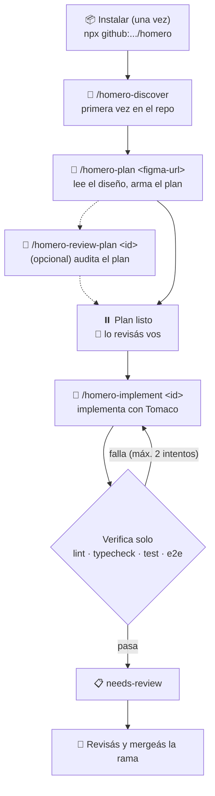

# 🤖 Homero

Harness de frontend para Falabella Seguros. Le hablás a Claude Code o GitHub
Copilot en lenguaje natural — vos no tipeás comandos de Homero, se los decís
a tu IA.

## Cómo funciona

```mermaid
flowchart TD
    A["📦 Instalar (una vez)<br/>npx github:.../homero"] --> B["💬 /homero-discover<br/>primera vez en el repo"]
    B --> C["💬 /homero-plan &lt;figma-url&gt;<br/>lee el diseño, arma el plan"]
    C -.-> R["💬 /homero-review-plan &lt;id&gt;<br/>(opcional) audita el plan"] -.-> D
    C --> D["⏸️ Plan listo<br/>👤 lo revisás vos"]
    D --> E["💬 /homero-implement &lt;id&gt;<br/>implementa con Tomaco"]
    E --> F{"Verifica solo<br/>lint · typecheck · test · e2e"}
    F -- "falla (máx. 2 intentos)" --> E
    F -- "pasa" --> G["📋 needs-review"]
    G --> H["👤 Revisás y mergeás la rama"]
```

## Comandos

| Cuándo | Qué le decís a tu IA |
| --- | --- |
| Instalar (una vez, en la terminal) | `npx github:DanielRamosValenzuela/homero` |
| Primera vez en el repo | `/homero-discover` |
| Para planear una pantalla | `/homero-plan <figma-url>` |
| (Opcional) auditar el plan antes de aprobarlo | `/homero-review-plan <id>` |
| Para implementar un plan ya revisado | `/homero-implement <id>` |
| Todo junto (igual pausa a revisar el plan, salvo que le digas "sin pausar") | `/homero <figma-url>` |
| Retomar un feature en otra sesión | "Trabaja el feature FEAT-042" |

Más detalle (comandos crudos, guardrails, arquitectura): [`docs/usage.md`](./docs/usage.md).

## 📄 Licencia

MIT — ver [`LICENSE`](./LICENSE).
