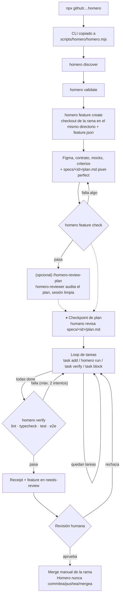
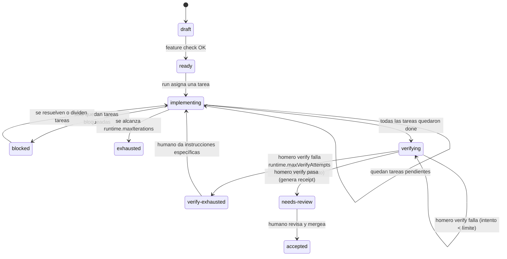
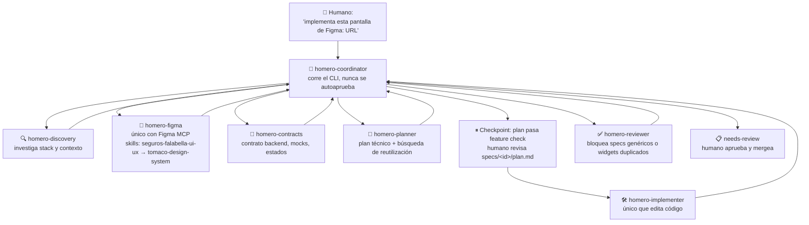

# Uso detallado y referencia de comandos

Esta página es para cuando querés entender o manejar Homero manualmente —
comandos crudos, flags, y cómo funciona por dentro. Para el uso normal
(hablarle a tu IA), ver el [`README`](../README.md).

## De un vistazo

Homero no es solo un instalador de archivos. Convierte cada feature en un
**contrato ejecutable** (`feature.json`) y un **loop de tareas con estado en
disco** (`state.json` + `events.ndjson`), para que la IA pueda retomar el
trabajo exactamente donde quedó — aunque cambie de sesión o de cliente
(Copilot/Claude) — y para que nadie, ni la IA, se autoapruebe.



## Guardrails (no negociables)

Estas reglas viven en `docs/homero/constitution.md` y se aplican vía gates de
código (`homero feature check` falla si no se cumplen) o vía instrucciones
que todo agente Homero lee antes de trabajar:

| Gate | Qué garantiza |
| --- | --- |
| 🎨 Tomaco obligatorio | Toda UI usa el design system; nada de CSS/Tailwind crudo sin excepción registrada |
| 🖼️ Figma aprobado | URL, node y versión quedan registrados en cada `feature.json` |
| 📐 Plan pixel-perfect | Componentes de Tomaco, tokens y estilos exactos por pantalla — un plan sin eso no pasa el gate |
| ⏸️ Checkpoint humano | El plan se detiene para revisión antes de implementar, salvo que pidas explícitamente lo contrario |
| 📜 Contrato de backend | `contract-first` / `contract-draft` / excepción explícita — nunca un mock inventado en silencio |
| ❓ Preguntas específicas, no genéricas | El error de validación exacto por campo y el comportamiento de cada elemento interactivo deben confirmarse |
| 🧪 Evidencia Playwright CLI | Screenshots y snapshots reales antes de pasar a `needs-review` |
| 🔒 Solo humanos mergean | Homero nunca commitea, pushea, ni se autoaprueba |

## Requisitos

Git, Node.js ≥18, un gestor de paquetes (npm, pnpm o yarn — `discover`
detecta cuál según el lockfile del repo), un repo frontend con
`package.json`, y un Figma aprobado + contrato de backend (o ejemplos/cURLs)
por feature.

## Instalar

Un solo comando, parado en la raíz de tu repo:

```powershell
npx github:DanielRamosValenzuela/homero
```

Copia el CLI a `scripts/homero/homero.mjs` y los adapters de `--client both`
(Copilot + Claude). Equivale a `init --target . --client both
--project-name <carpeta>`; agregá `--client claude|copilot` o
`--project-name` si querés otro valor.

De acá en adelante todo corre local, sin `npx`:

```powershell
node scripts/homero/homero.mjs discover --target .
```

`discover` te pregunta por el stack y el contexto de negocio, y con eso escribe
`homero.config.json` más los cinco docs de `docs/homero/`. La primera vez
reemplaza los templates que dejó `init`; de ahí en adelante los respeta y te
avisa con `SKIP ... (already discovered)`, porque puede que los hayas editado a
mano. Usá `--force` cuando quieras regenerarlos desde tus respuestas nuevas.

No hace falta correrlo a mano: es el mismo comando que usa `homero-coordinator`
por dentro cuando le pedís `/homero-discover` — te hace las preguntas ahí
mismo y corre `discover` con tus respuestas como flags (`--framework`,
`--formStack`, `--countries`, etc. — `--defaults` rellena lo que no
preguntó). El comando de consola sigue sirviendo igual si preferís
manejarlo vos, o si tu cliente no soporta agentes personalizados.

`init`, `upgrade` y `validate` son los únicos comandos que siguen yendo por
`npx` (necesitan el source de Homero, no el archivo ya copiado); todo el
resto corre desde la copia vendorizada en `scripts/homero/homero.mjs`.

### Actualizar una instalación existente

El comando es `upgrade`, no `init --force`:

```powershell
npx github:DanielRamosValenzuela/homero upgrade --target . --dry-run
npx github:DanielRamosValenzuela/homero upgrade --target .
```

`upgrade` refresca lo que Homero gestiona (CLI vendorizado, agentes, skills,
reglas, comandos, templates) y:

- **Nunca toca los cinco docs que escribe `discover`** (`business.md`,
  `architecture.md`, `conventions.md`, `contracts.md`, `constitution.md`). Si
  alguno se separó del template, deja el nuevo al lado como
  `<archivo>.homero-new` para que compares y mergees a mano.
- **Nunca pisa un `AGENTS.md`, `CLAUDE.md` o `.github/copilot-instructions.md`
  que hayas escrito vos.** Los que instala Homero llevan un comentario
  `homero:managed` en las primeras líneas; si el archivo no lo tiene, lo trata
  como tuyo y deja un `.homero-new`. Borrar esa línea es la forma explícita de
  tomar posesión del archivo.
- **Respeta el catálogo generado.** Una vez que corriste `generate catalog`,
  `component-api.md` queda marcado como generado y `upgrade` lo deja intacto
  (lo reporta como `KEEP`) en vez de revertirlo al placeholder.
- **Mergea `homero.config.json` en profundidad**: tus valores sobreviven, los
  arrays quedan tal como los dejaste, y las claves nuevas de la versión se
  agregan solas.
- **Exige el árbol Git limpio**, así que la corrida es revertible: `git
  checkout .` para los archivos modificados y `git clean -fd` para los que
  agregó (los nuevos son untracked y sobreviven a un checkout). `--force` se
  salta el chequeo.
- Con `--dry-run` te muestra exactamente qué tocaría sin escribir nada.

El `--client` sale de `homeroClient` en `homero.config.json`. Los repos
instalados con 0.1.x no lo tienen registrado, y ahí `upgrade` **se niega a
correr** en vez de adivinar — asumir `both` instalaría un adapter entero como
archivos nuevos, que al ser untracked no los borra un `git checkout .`. Pasale
`--client copilot|claude|both` una vez y queda registrado para siempre.

`init --force` sigue existiendo, pero es la reinstalación bruta: pisa todo lo
que Homero gestiona, incluido `homero.config.json`, y te obliga a correr
`discover` de nuevo. Usalo solo si querés volver a cero.

Para ver en qué versión estás — la del source, la de `homero.config.json` y la
del CLI vendorizado, con aviso si hay drift entre ellas:

```powershell
npx github:DanielRamosValenzuela/homero version --target .
```

Ver [`CHANGELOG.md`](../CHANGELOG.md) para qué significa cada salto de versión.

### MCP (Figma, y opcionalmente Tomaco)

Copiá `mcp.example.json` a `.mcp.json` y completá tus servidores MCP reales
(Figma y los que sumes) — `.mcp.json` queda gitignoreado porque puede
terminar con tokens, mismo patrón que `.env`/`.env.example`. Con `--client
copilot` además hay que registrar el servidor de Figma para el coding agent
a nivel de repo u organización (**Settings → Copilot → Coding agent → MCP
servers**); es una superficie distinta de `.mcp.json`, que solo sirve para
uso local/Claude.

`mcp.example.json` también trae `tomaco-mcp-server` documentado como entrada
**opcional y deshabilitada por default** (`tomaco-mcp-server-disabled`) —
validación en vivo de componentes/props/clases CSS de Tomaco, mantenido por
el equipo de design system, no por Homero. Confirmá con ese equipo si está
desplegado para tu organización antes de habilitarlo (necesita
`NPM_REGISTRY_TOKEN` salvo que `tomaco-components` ya esté instalado
localmente); si no lo tenés, la skill `tomaco-design-system` sigue
funcionando igual con las referencias estáticas.

### Setup opcional

```powershell
node scripts/homero/homero.mjs setup playwright --target .
```

Instala `@playwright/test`, `@playwright/cli`, `@axe-core/playwright` y
Chromium (`--dry-run` para previsualizar).

```powershell
node scripts/homero/homero.mjs setup graphify --target .
```

Instala [graphify](https://github.com/Graphify-Labs/graphify) y agrega
`graphify-out/` al `.gitignore`. La constitución (`docs/homero/constitution.md`)
exige usar `graphify query` en vez de leer archivo por archivo al explorar
código no familiar — no es un gate de `feature check`, es control de costo
de tokens.

### Proyectos con otra estructura de carpetas (o monorepos)

Homero no asume `src/ui`, `src/app`, etc. de forma rígida: `homero discover`
pregunta por `uiRoot`, `stepRoot`, `serverActionsRoot`, `storesRoot`,
`widgetsRoot` y `testRoot`, y los deja registrados en `homero.config.json` bajo
`paths`. Todos los docs y agentes generados leen esas rutas en vez de asumir
las del template.

Si el repo es un **monorepo**, instala Homero por app, apuntando `--target` a
la carpeta de esa app (no a la raíz del workspace):

```powershell
npx github:DanielRamosValenzuela/homero init --target apps/web --client both --project-name mi-app-web
node apps/web/scripts/homero/homero.mjs discover --target apps/web
```

Esto crea un `homero.config.json`, `docs/homero/`, `features/` y `specs/`
independientes por app. `homero feature create` sigue funcionando igual: la
rama que crea es de todo el repo (git no scopea ramas a una carpeta, aunque
`--target` sí scopea dónde Homero escribe archivos), así que una feature
puede seguir tocando otro paquete del monorepo si hace falta — solo que el
contrato, el estado del loop y la verificación quedan scoped a la app donde
corriste `init`.

## Uso

Homero organiza el trabajo en **features**: una unidad con su propia rama,
contrato (`feature.json`), spec y lista de tareas. El ciclo completo es
`crear → completar contrato/plan → checkpoint de revisión → trabajar (loop)
→ verificar → aceptar/merge`.

Por dentro, un feature avanza por estas fases (`state.phase` en
`features/<id>/state.json`, visible con `homero task status`):



`blocked`, `exhausted` y `verify-exhausted` no son callejones sin salida: son
la señal de que hay que mirar el feature a mano en vez de seguir
reintentando a ciegas. `verify-exhausted` corta el loop apenas `homero
verify` falla 2 veces seguidas (`runtime.maxVerifyAttempts`) — a partir de
ahí, `homero verify` se niega a correr de nuevo hasta que un humano revise
el receipt y arregle algo puntual o cambie el límite.

Fuera de `state.phase` hay un checkpoint anterior que no vive en el
`state.json` sino en el comando que uses: una vez que `specs/<id>/plan.md`
pasa `feature check`, el agente se detiene y reporta el plan — no crea
tareas ni delega en `homero-implementer` hasta que vos digas que sigas
(constitution.md principio 9). `/homero-plan` siempre se detiene ahí;
`/homero-implement` asume que ya lo revisaste; `/homero` hace las dos cosas
pero también pausa ahí por default.

Antes de aprobar, opcionalmente podés correr `/homero-review-plan <id>`:
arranca una sesión nueva, sin la conversación de planificación acumulada
(que puede ser larga — Figma, contrato, varias vueltas), lee
`spec.md`/`plan.md`/`feature.json` tal cual quedaron en disco, y delega en
`homero-reviewer` en modo plan para auditar consistencia interna (¿los
componentes de Tomaco que nombra realmente encajan? ¿el plan técnico
contradice algo del spec? ¿quedó una pregunta abierta sin resolver?). No es
un gate de CLI — es una segunda opinión barata (sesión limpia, sin arrastrar
contexto) que podés pedir o saltarte.

### 1. Crear el feature

```powershell
node scripts/homero/homero.mjs feature create `
  --target . `
  --id FEAT-042 `
  --name "Cotizador de vida" `
  --figma "https://www.figma.com/design/...?..." `
  --figma-version "approved-v3" `
  --contract-mode contract-draft `
  --contract-source "docs/contracts/quote.openapi.yaml" `
  --countries cl
```

- Antes de correr esto tenés que estar parado en una rama propia, no en la
  principal (`git checkout -b feature/FEAT-042-cotizador-de-vida`) — el
  comando ya no crea la rama por vos, solo escribe en la que ya tengas
  activa. Si corrés esto sobre la rama principal, falla y te pide que crees
  una rama primero.
- El árbol Git debe estar limpio antes de correr esto. Eso significa: solo
  una feature a la vez por checkout. Si tenés otra en curso sin commitear,
  commiteala (o hacé stash) antes de crear una nueva; y para retomar una
  feature ya creada en otra sesión, primero cambiate a su rama (`git checkout
  feature/FEAT-042-cotizador-de-vida`).
- `--countries` es obligatoria (lista separada por comas, ej. `cl,pe`) y queda
  registrada en `feature.json` como `product.countries` — toda feature debe
  declarar qué país(es) cubre.

El comando queda parado en la misma carpeta, sobre la rama que vos ya tenías
activa. Ahí se generaron:

```text
features/FEAT-042/
  feature.json          # el contrato: fuente de verdad del feature
  state.json             # estado del loop de tareas (fase, iteraciones, tareas)
  events.ndjson          # historial de eventos del loop
  evidence/playwright-cli.json
specs/FEAT-042-cotizador-de-vida/
  spec.md
  plan.md
  tasks.md
```

### 2. Completar y validar el contrato y el plan

`feature.json` nace en estado `draft`. Complétalo antes de pedir
implementación: criterios de aceptación, preguntas abiertas resueltas, mocks
de desarrollo (si consume backend), estados de carga/éxito/vacío/error, y
Figma + versión aprobados. `specs/<id>/plan.md` también nace con placeholders
vacíos — hay que llenarlo con los componentes de Tomaco exactos, sus tokens,
y el detalle pixel-perfect (paddings, layout, breakpoints) de cada pantalla
antes de que pase el gate (principio 18 de `docs/homero/constitution.md`).
Luego:

```powershell
node scripts/homero/homero.mjs feature check --target . --id FEAT-042
```

Bloquea el trabajo si falta Figma, contrato, mocks, criterios, o alguna
sección requerida de `plan.md` (componentes/tokens de Tomaco, estilos
pixel-perfect, archivos a crear o modificar, plan de formulario/validación,
adaptación de Figma), o si no estás parado en la rama del feature. Este mismo
chequeo se vuelve a correr por dentro cada vez que uses `homero run`, así que
un feature incompleto nunca llega a la etapa de implementación.

Deliberadamente **no** exige evidencia de Playwright acá — eso solo puede
existir una vez que algo esté implementado, así que exigirlo antes de
implementar volvería el gate imposible de pasar (era exactamente ese bug:
`feature check` bloqueaba `/homero-implement` incluso con el plan
perfectamente completo, porque pedía capturas de una UI que todavía no
existía). La evidencia se exige en `homero verify`, una vez que hay algo que
verificar.

Cuando pasa, ese es el checkpoint: revisá `spec.md` y `plan.md` vos mismo
antes de seguir. No hay comando que salte este paso — es una decisión
humana, no un gate de CLI.

### 3. Trabajar el feature — el loop de tareas

```powershell
# Declara las tareas del feature (una vez, al empezar)
node scripts/homero/homero.mjs task add --target . --id FEAT-042 --title "Armar formulario"
node scripts/homero/homero.mjs task add --target . --id FEAT-042 --title "Agregar validaciones"

# Pide la próxima tarea
node scripts/homero/homero.mjs run --target . --id FEAT-042
```

`homero run` es el único comando que avanza el loop. Cada vez que lo llamas:

- Te devuelve la tarea activa, las rutas sugeridas y los comandos exactos para
  cerrarla (nunca llama a un modelo de IA — es solo lectura/escritura de
  estado).
- Si ya no quedan tareas pendientes, te dice qué sigue (`homero verify`, o
  esperar revisión humana).
- Si superaste `runtime.maxIterations` (`homero.config.json`), falla con
  `error_max_iterations` y marca el feature como `exhausted` — es la señal de
  que hay que revisar manualmente, no seguir reintentando a ciegas.

Cierra cada tarea según cómo te fue:

```powershell
# Terminada
node scripts/homero/homero.mjs task verify --target . --id FEAT-042 --task T-001 --summary "Formulario armado con Tomaco"

# No pudiste completarla
node scripts/homero/homero.mjs task block --target . --id FEAT-042 --task T-001 --reason "Falta el contrato de backend"
```

`task block` reintenta la tarea hasta `runtime.maxAttemptsPerTask` intentos;
al superarlos, la tarea queda bloqueada de forma permanente
(`error_max_attempts_per_task`) y hay que resolverla o dividirla a mano.
Repite `homero run` → `task verify`/`task block` hasta que no queden tareas.

En cualquier momento, para ver en qué quedó todo (fase, iteraciones, tareas,
últimos eventos):

```powershell
node scripts/homero/homero.mjs task status --target . --id FEAT-042
```

Esto es lo que hace que el trabajo se pueda **retomar**: todo el progreso vive
en `features/FEAT-042/state.json` y `events.ndjson`, no en la memoria de la
conversación de IA. Si una sesión se corta a mitad de camino, la siguiente
sesión (del mismo cliente o del otro) corre `task status`, ve exactamente
dónde quedó, y sigue — no hay que volver a explicarle nada.

### 4. Verificar y cerrar

La IA guarda screenshots y snapshots de Playwright CLI bajo
`features/FEAT-042/evidence/`. Cuando todas las tareas estén hechas:

```powershell
node scripts/homero/homero.mjs verify --target . --id FEAT-042
```

Ejecuta lint, typecheck, tests y E2E reales según `homero.config.json`. Si
pasan, genera un receipt en `features/FEAT-042/receipts/` y el feature pasa a
`needs-review` — nadie, ni la IA, se autoaprueba desde ahí.

Un humano revisa el receipt y la evidencia (commiteando lo que haga falta en
el camino — Homero nunca commitea, pushea, ni mergea por su cuenta). Si
aprueba: cambia a la rama base y mergea `feature/FEAT-042-cotizador-de-vida`
normalmente, como cualquier otra rama:

```powershell
git checkout main
git merge feature/FEAT-042-cotizador-de-vida
```

## Agentes y delegación (Claude / Copilot)

Con `--client claude` o `--client both`, `homero-coordinator` no hace todo
esto con un solo modelo genérico: delega en agentes especializados, cada uno
con su propio scope y permisos. Esto es lo que pasa por dentro cuando le das
una instrucción a `/homero-plan` o `/homero`:



Vos siempre hablás con `homero-coordinator`, nunca directo con un sub-agente
— cada uno corre en segundo plano y le reporta a él (constitution.md
principio 20). Los sub-agentes suelen tener un modelo distinto fijado a
propósito (`homero.config.json` `agents.models`); si algo te pusiera a
hablar directo con uno, terminarías conversando con ese modelo sin darte
cuenta.

`homero-figma` es el único agente con acceso al MCP de Figma — los demás
dependen de lo que él devuelve. `homero-implementer` es el único que edita
archivos de producto. Si tu cliente de IA no soporta agentes personalizados,
`docs/homero/agent-roles.md` define los mismos roles para seguirlos en una
sola sesión.

Las dos skills del diagrama las instala Homero: con `--client claude` (o
`both`) quedan en `.claude/skills/seguros-falabella-ui-ux/` y
`.claude/skills/tomaco-design-system/` — no hay que escribirlas a mano. Con
`--client copilot` (o `both`) el mismo contenido se instala como
`.github/instructions/seguros-falabella-ui-ux.instructions.md` y
`.github/instructions/tomaco-design-system.instructions.md` (Copilot no tiene
concepto de skills, así que se aplican solas vía `applyTo` en vez de
invocarse por nombre). `seguros-falabella-ui-ux` responde el *por qué* y el
*dónde* (layout, jerarquía, patrones); `tomaco-design-system` responde el
*qué* exacto: qué componente, prop o token existe realmente en código.

Esa segunda skill lee un **inventario de componentes** generado desde tu
instalación real: los 40 componentes de Tomaco con su descripción y sus
keywords, agrupados por categoría. Sin él, el archivo dice *"NOT GENERATED
YET"* y el agente vuelve a nombrar componentes de memoria — que es
exactamente lo que la constitución prohíbe.

`tomaco-design-system` también trae `references/component-gotchas.md`
(`.github/instructions/tomaco-component-gotchas.md` en Copilot) — a
diferencia del inventario, este archivo **no se genera**, es una auditoría
manual del código real de `tomaco-components@1.14.42`: props mal nombradas,
`id`/`name` hardcodeados que colisionan con dos instancias en la misma
página, componentes totalmente controlados, truncado silencioso, props que
compilan pero no hacen nada en runtime. Ninguna de esas trampas sale en el
inventario generado (que solo trae nombre/descripción/keywords) ni en los
tipos de TypeScript — hay que releerlo y actualizarlo a mano si el equipo
sube de versión Tomaco.

Un tercer archivo, `references/css-utilities.md`
(`.github/instructions/tomaco-css-utilities.md` en Copilot), es el catálogo
positivo de clases CSS, grilla y tokens de color — verificado contra el Sass
real (`grid.sass`, `variables.sass`, `helpers.sass`) del propio
`tomaco-components`, no solo contra patrones. Ahí quedan documentados dos
overrides de Tomaco que no coinciden con Bootstrap estándar: los containers
topan en `1152px` a partir de `lg` (no siguen creciendo en `xl`/`xxl`), y el
gutter default de `.row` es `32px`, no `24px`. Tampoco se genera — igual que
`component-gotchas.md`, hay que releerlo si Tomaco cambia su grilla o sus
tokens.

Un cuarto archivo, `references/component-spacing.md`
(`.github/instructions/tomaco-component-spacing.md` en Copilot), trae el
padding/dimensiones/overflow default de cada componente — verificado contra
el `.sass` real de cada componente, no adivinado. Existe porque un valor de
espaciado medido en Figma es el resultado ya renderizado, que puede incluir
el padding que el componente ya trae por defecto (ej. `Input` ya trae
`16px 12px`) — sin este archivo, `homero-implementer` podía aplicar el valor
completo de nuevo sobre un wrapper y sumar más espacio del que Figma
realmente muestra. Tampoco se genera, mismo criterio de mantenimiento que
los dos anteriores.

**No hace falta que lo corras a mano.** `init` y `upgrade` lo generan solos si
`node_modules` ya tiene el paquete, y `validate` te avisa cuando falta o quedó
viejo. El destino depende de `homeroClient` en `homero.config.json`: escribe
`.claude/skills/tomaco-design-system/references/component-api.md` para
claude/both y `.github/instructions/tomaco-component-api.md` para
copilot/both — en una instalación `both` genera los dos:

```text
WARN  The tomaco-components catalog was generated against a different version
      than the installed 2.0.0. Run `homero generate catalog --target .`
```

El caso típico donde sí lo corrés a mano es después de instalar dependencias
por primera vez (npm/pnpm/yarn install) — si instalaste Homero antes de eso — o tras un bump
de Tomaco si no vas a correr `upgrade`:

```powershell
node scripts/homero/homero.mjs generate catalog --target .
```

Lee el paquete declarado en `product.designSystemPackage` de
`homero.config.json` (por defecto `tomaco-components`, o `--package` para
pisarlo). Prefiere el bloque `tomaco` que el propio paquete publica en su
`package.json` — categorías, descripciones y keywords, que es lo que permite
buscar *por necesidad* y no por nombre — y lo cruza contra los exports reales
del bundle para avisar si la metadata del paquete se separó de su build.
Deliberadamente **no lista props**: inferidos mienten más de lo que ayudan.

Si el paquete no está instalado no rompe nada: sale con código 0 y la skill
sigue funcionando leyendo el paquete y el repo directamente. Y una vez
generado, `upgrade` **no lo pisa** — lo reporta como `KEEP`.

## Comandos

Usa `node scripts/homero/homero.mjs <comando> --help` para ver los argumentos disponibles (`init`/`upgrade`/`validate` van por `npx`, ver [Instalar](#instalar)).

**Setup del repo** — una vez por proyecto

| Comando | Uso |
| --- | --- |
| `homero init` | Instala Homero y los adapters de IA. |
| `homero upgrade` | Actualiza una instalación existente sin pisar los docs de `discover` ni tus valores de config (`--dry-run` para previsualizar). |
| `homero version` | Muestra la versión del source, la de `homero.config.json` y la del CLI vendorizado, y avisa si hay drift. |
| `homero discover` | Registra el contexto del proyecto. |
| `homero validate` | Valida la instalación de Homero. |
| `homero setup playwright` | Instala Playwright localmente. |
| `homero setup graphify` | Instala graphify (grafo de conocimiento para explorar código). |

**Ciclo de vida del feature**

| Comando | Uso |
| --- | --- |
| `homero feature create` | Exige estar en una rama propia (no la principal) ya creada, y crea los artefactos del feature ahí. |
| `homero feature check` | Valida que el feature (contrato + plan) esté listo — es el gate del checkpoint. |
| `homero verify` | Ejecuta lint/typecheck/test/e2e y genera el receipt. |

**Loop de tareas** — con la rama del feature ya checked out

| Comando | Uso |
| --- | --- |
| `homero task add` | Agrega una tarea de seguimiento al feature. |
| `homero run` | Devuelve la próxima tarea o acción del loop (nunca llama a un modelo). |
| `homero task verify` | Marca una tarea como completada. |
| `homero task block` | Registra un intento fallido de una tarea. |
| `homero task status` | Muestra fase, iteraciones, tareas y últimos eventos. |

**Generadores**

| Comando | Uso |
| --- | --- |
| `homero generate form` | Genera un formulario repetitivo por país. |
| `homero generate catalog` | Genera el inventario de componentes de Tomaco (`--client`-aware: escribe en `.claude/` y/o `.github/` según `homeroClient`). |

## Desarrollo local

```powershell
npm run homero -- init --target C:\ruta\al\repo --client both --project-name mi-proyecto
npm run validate:self
# equivalente: npm test
```

`npm run bootstrap -- <flags>` y `npm run validate:target -- <flags>` son
atajos finos sobre `homero init`/`homero validate` (evitan escribir `node
./packages/cli/bin/homero.mjs` completo) para cuando estás parado en el
propio repo de Homero probando contra un repo target.

`.github/workflows/ci.yml` corre `validate:self` en cada push/PR a `main`, en
ubuntu-latest y windows-latest, contra Node 18 y 20.
